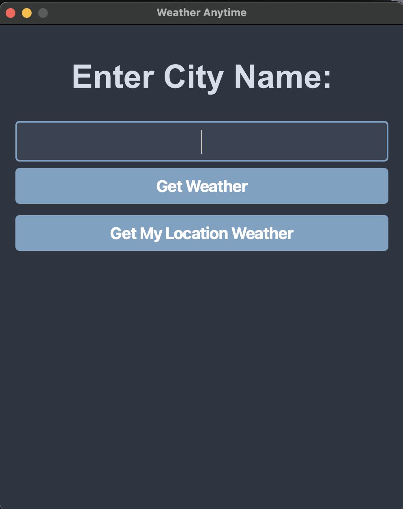
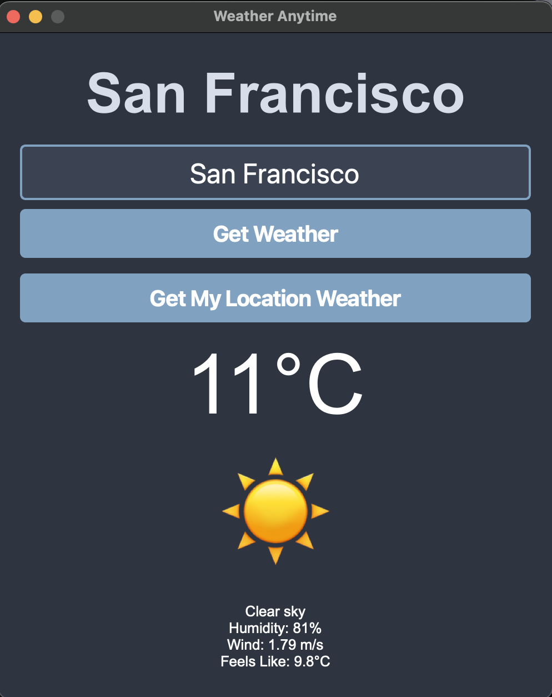
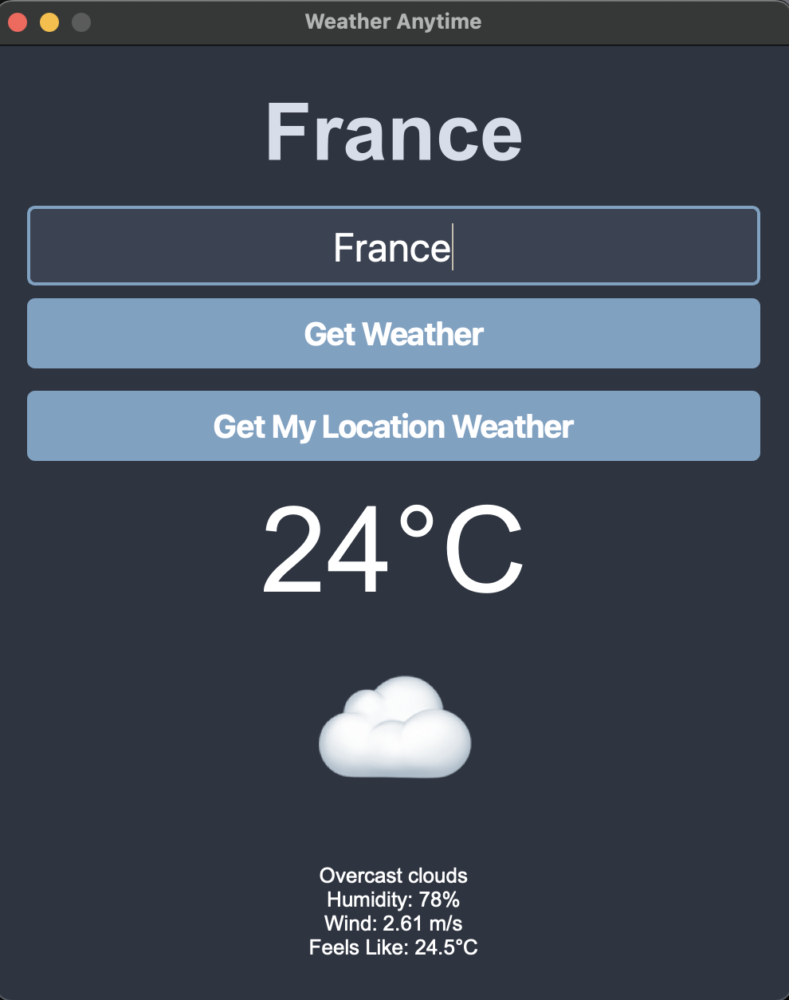

# 🌡️ Weather Anytime 
A modern **weather application** built using **Python (PyQt5) and OpenWeather API**, featuring **real-time weather updates, location-based search, and auto-suggestions**.

## 📌 Features

- ✅ **Real-time Weather Updates** - Fetch weather data for any city using OpenWeather API.
- ✅ **Location-Based Search** - Automatically detects and displays weather for your current location.
- ✅ **Dynamic Emoji Representation** - Displays weather conditions using expressive emojis.
- ✅ **Dark Mode UI** - A modern **PyQt5 interface** with a polished dark theme.
- ✅ **Auto-Suggestions** - Suggests cities as you type.
- ✅ **Robust API Handling** - Handles errors like invalid city names, API failures, and connectivity issues.

---

## 🛠️ Installation

### 🔹 Prerequisites

Ensure you have **Python 3.8+** installed.  
You also need **pip** to install dependencies.

### 🔹 Clone the Repository

```sh
git clone https://github.com/yourusername/weather-app.git
cd App_weather
```

### 🔹 Set Up OpenWeather API Key

Get an API key from OpenWeather.
Create a .env file in the project directory and add:
```sh
OPENWEATHER_API_KEY=your_api_key_here
```


### 🖼️ Screenshots

<p align="center">
  
</p>
<p align="center">
  
  
</p>


### 🔗 Technologies Used

- Python 3.x
- PyQt5 (GUI framework)
- Requests (API calls)
- Git & GitHub (Version control)
- OpenWeather API (Weather data)


